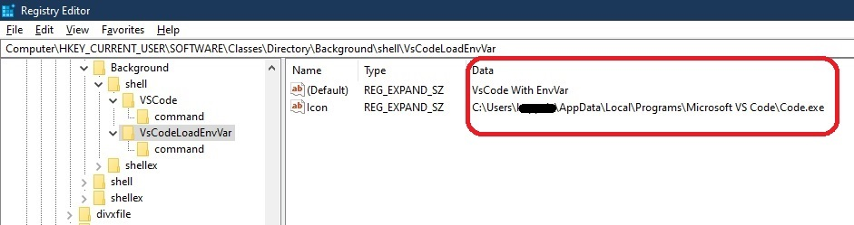
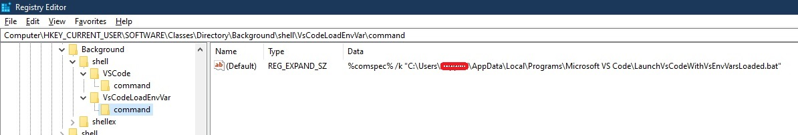

## Simple Power shell Script 

1. Run the powershell to create an entry in the registry. 

    

2. Registry Entry

    

## Verification
1. Ensure the file **LaunchVsCodeWithVsEnvVarsLoaded.bat** is here at this loction **C:\Users\koppviv\AppData\Local\Programs\Microsoft VS Code**. 
2. Ensure the registry entries.
3. 